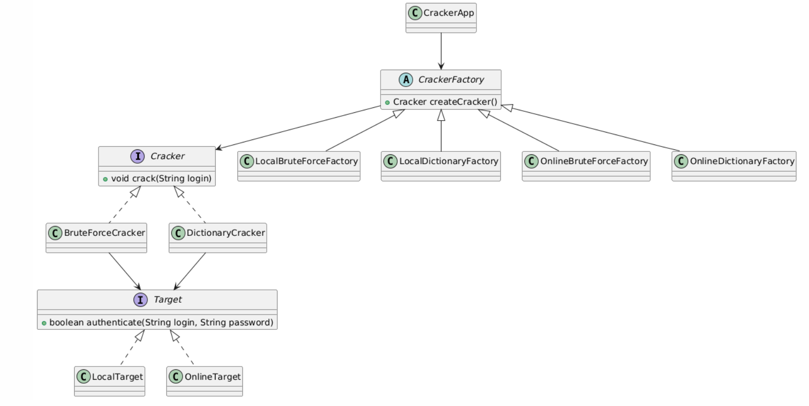

# Password Cracker Factory

Projet Java permettant de simuler deux techniques classiques de cassage de mot de passe (Brute Force et Dictionnaire) en utilisant le **patron de conception Fabrique** pour une architecture propre, modulaire et extensible.

---

## 1. Description de l’architecture logicielle

Le projet est structuré selon le principe **“ouvert à l’extension, fermé à la modification”** (OCP - SOLID).  
Il utilise des interfaces et des fabriques concrètes pour permettre de rajouter de nouvelles attaques ou cibles **sans modifier le code existant**.

### Organisation des packages :

- `app` : point d'entrée (CrackerApp.java)
- `cracker` : implémentations des attaques (BruteForceCracker, DictionaryCracker)
- `target` : cibles (LocalTarget, OnlineTarget)
- `factory` : fabriques qui instancient la bonne stratégie

---

## 2. Diagramme de classes UML

## 3. Choix du patron de conception et justification

Le projet utilise le patron de conception Fabrique (Factory Methode) pour créer dynamiquement des objets d’attaque (Cracker) adaptés au type de cible (Target).

## Avantages ✅ :
Permet d’ajouter facilement de nouvelles stratégies d’attaque ou de nouvelles cibles.

Évite les conditions if-else dans la classe principale (CrackerApp).

Respecte les principes SRP et OCP du modèle SOLID.

## 4. Explication des variantes implémentées

 Attaque par Dictionnaire :
 
Charge un fichier texte dico.txt
Teste chaque mot un par un
Plus rapide mais dépend de la qualité du dictionnaire
 
 Attaque par Brute Force :
 
Génère toutes les combinaisons possibles d’un alphabet a-z0-9
Longueur max configurable
Très lent mais infaillible (si mot de passe court)

## Cible Locale :
Login et mot de passe codés en dur dans le code
Authentification simulée via la console

## Cible En ligne :
Formulaire PHP accessible via http://localhost/login.php
Requêtes HTTP POST envoyées par le Java
Réponse traitée pour détecter un succès ou un échec

## 5. Pistes d'amélioration

Ajouter une attaque par Rainbow Table

Ajouter du multithreading pour accélérer le Brute Force

Autoriser des cibles distantes via une API Web sécurisée

Créer une interface graphique (Swing / JavaFX)

Rendre l’alphabet et la longueur dynamiquement configurables

Gérer plusieurs fichiers dictionnaires (par langue, type, etc.)

## Lancement du projet
Compilation :
javac -d bin src/app/*.java src/cracker/*.java src/factory/*.java src/target/*.java

Exemples d'exécution :
java -cp bin app.CrackerApp --type dictionnary --target local --login admin

java -cp bin app.CrackerApp --type bruteforce --target online --login admin

Voir dico.txt pour les mots de passe à tester

Le fichier PHP cible se trouve dans login.php

👩Auteur :
Fatoumata Barro, Abdourahmane Tall, Adama Sidibe, Khadim Mbaye, Thierno Abdoulaye Sall

DIC1 – ESP – Projet Patron de Conception
Juillet 2025
